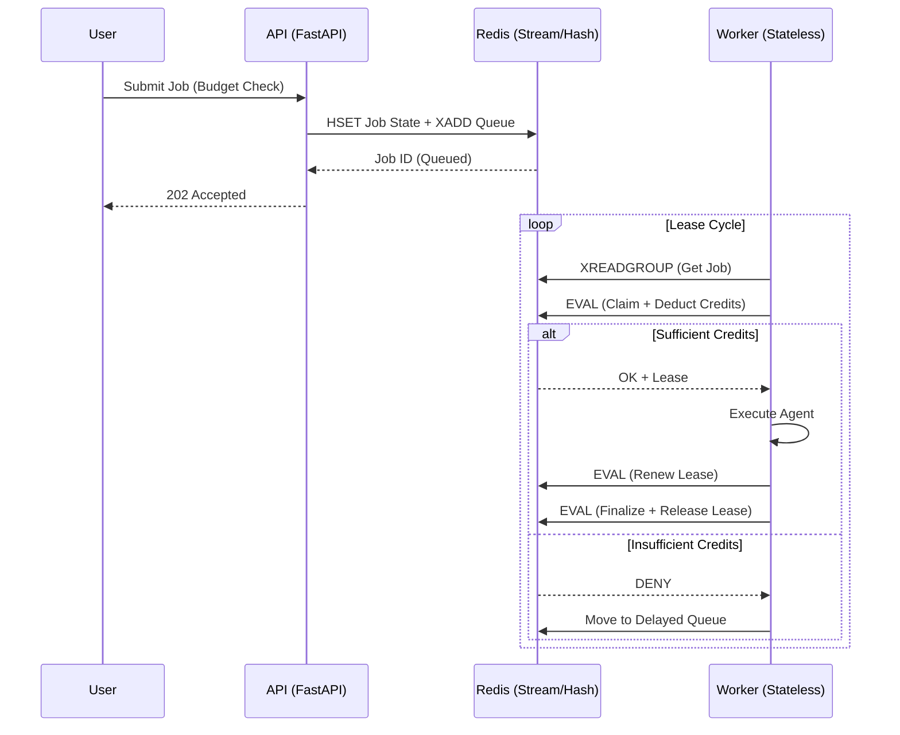

This architecture is built around one rule:

**Workers execute. The system decides.**

That separation is what makes fairness, retries, and crash recovery reliable at scale.
# Architecture Overview

This system treats GPUs as governed resources.

## System Data Flow

## **Two-plane model**
## Control plane (Redis + API)

* owns truth: job state, quotas, leases

* decides who is allowed to run

* ensures retries and crash recovery are safe

## Data plane (Workers)

* stateless executors

* run jobs only while holding a valid lease

* can crash without corrupting global state

## **Key invariants**
* No job runs without paying (quota charge happens inside CLAIM).

* No worker owns a job permanently (execution rights are leased).

* If a worker dies, the system recovers (lease expiry + reaping).

* Fairness is enforced before execution (token bucket at claim time).

This design favors determinism over cleverness.

